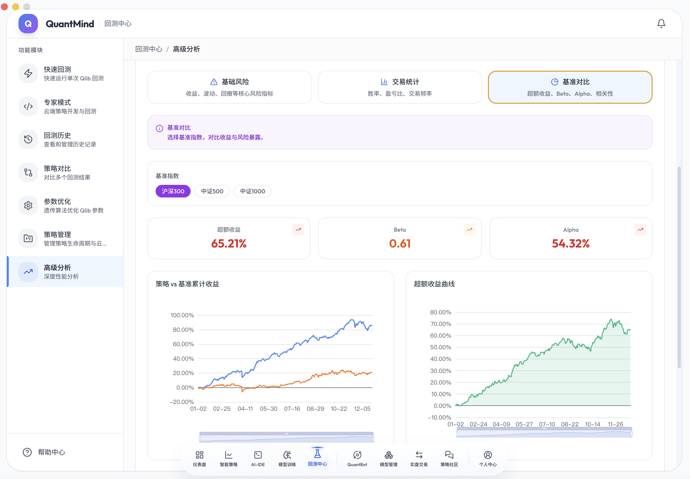
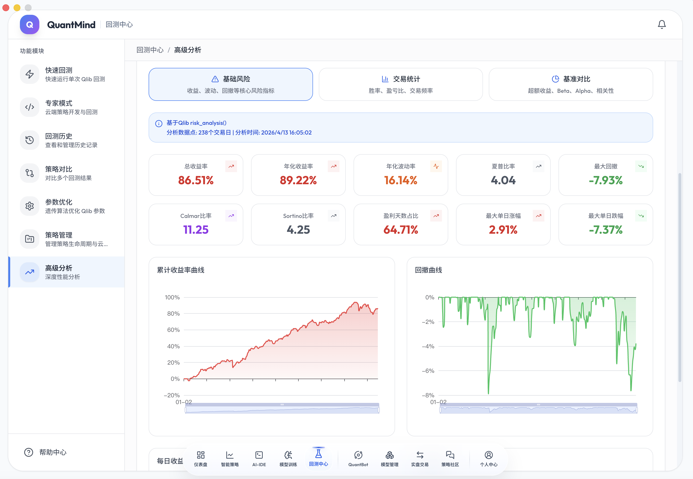

<div align="center">

# 🚀 QuantMind

### 工业级 AI 原生量化交易平台 · 让机器学习自动学习市场规律

<p align="center">
  <b>Multi-Market AI Quantitative Trading Platform</b><br/>
  <i>A股 · 港股 · 美股 · 数字货币 · 期货</i>
</p>

[](https://www.python.org/)
[](https://nodejs.org/)
[](https://www.typescriptlang.org/)
[](https://github.com/microsoft/qlib)
[](https://pytorch.org/)
[](https://www.docker.com/)
[](LICENSE)

<br/>

**🌐 语言切换 Language** · [简体中文](README.md) · [English](README_EN.md) · [繁體中文](README_ZH-Hant.md) · [QuantDB 官网](https://quantdb.quantmind.cloud/) · [加入交流群](#-交流社区)

<br/>

```
[ QuantDB 专业数据 ] ➔ [ 151+ 维特征工程 ] ➔ [ 13 种 ML/DL 模型训练 ] ➔ [ AutoDL GPU 算力集群 ]
                                                                                ↓
[ 通达信闪电下单 ]  ← [ 模拟/实盘风控 ]   ← [ 每日生产 IC 回填与监控 ] ← [ 截面排序与动态融合 ]
```

<br/>

<a href="#-核心亮点">核心亮点</a> •
<a href="#-系统功能展示">功能图览</a> •
<a href="#-a-股数据底座-quantdb">数据底座</a> •
<a href="#-ai-模型训练工场">模型训练</a> •
<a href="#-系统架构">系统架构</a> •
<a href="#-通达信实盘生态">通达信生态</a> •
<a href="#-智能体投研矩阵">智能体矩阵</a> •
<a href="#-快速开始">快速开始</a>

---

</div>

<br/>

<!-- ========================================== -->
<!-- HERO BANNER / 平台全景主图截图预留区 -->
<!-- ========================================== -->
<div align="center">
  <p><b>👇 QuantMind 现代化量化工作台全景</b></p>
  
  <p><i>（包含实时行情监控、策略运行看板、AI 模型推理信号流与风控仪表盘）</i></p>
</div>

<br/>

## 🌟 为什么选择 QuantMind？

传统量化往往受困于两大痛点：**“找数据耗费 80% 时间”** 与 **“手工拼凑线性因子的过拟合陷阱”**。

**QuantMind 打破了传统量化的桎梏 —— 它是真正的 AI 原生量化体系：**
1. **数据到手，开箱即练**：深度整合 **QuantDB** 专业量化数据源，5000+ 标的、315+ 维清洗好的 AI 因子库，Parquet/DuckDB 秒级加载，无需自行对齐清洗。
2. **AI 自动学习市场规律**：集成 **13 种机器学习与深度学习模型**（LightGBM、CatBoost、LSTM、Transformer、TabNet 等），通过非线性特征交互与时序建模捕捉 Alpha。
3. **闭环工业化流水线**：从数据特征 ➔ 模型训练（支持远程 GPU）➔ 模型版本与软门禁 ➔ 截面推理 ➔ 通达信预警推送/实盘下单，一键直通。

### 📊 传统量化 vs QuantMind AI 量化

| 核心维度 | 传统量化模式 | QuantMind AI 原生量化 | 带来的业务价值 |
| :--- | :--- | :--- | :--- |
| **数据准备** | 编写数十个爬虫，繁重的数据清洗与复权对齐 | **QuantDB 一键同步**，315 维高质量清洗特征 | **研发周期从数周缩减至分钟级** |
| **特征发掘** | 人工试错、单因子线性加权 | **151+ 维特征工程 + RD-Agent 自动因子进化** | **自动捕获高阶非线性 Alpha 规律** |
| **建模能力** | 简单多因子评分卡、线性回归 | **13 种 ML/DL 架构**（树模型 + 循环网络 + 自注意力）| **适应牛熊震荡等多种复杂市场风格** |
| **超参调优** | 手动调参，极易在历史数据上过拟合 | **Optuna TPE 智能搜索**，以 Rank ICIR 为目标 | **极大提升模型样本外（OOS）泛化能力** |
| **模型运维** | 训练完黑盒上线，缺乏跟踪 | **生产 IC 每日回填 + 漂移预警 + A/B 对比** | **全天候掌控模型衰减与有效性** |
| **实盘落地** | 需独立开发下单网关与软件插件 | **原生打通通达信**（自定义板块 + 预警 + 双击闪电下单） | **研究与实盘无缝衔接，毫秒级执行** |

---

## 📸 系统功能展示

> 💡 **提示**：QuantMind 拥有基于 **Electron + React 18 + TypeScript + Ant Design** 打造的现代化桌面/Web 统一工作台。

<table>
  <tr>
    <td width="50%" align="center">
      <b>🧠 1. AI 模型训练工场 (Model Training)</b><br/><br/>
      
      <br/>
      <sub>可视化配置 13 种模型，支持 Optuna 自动调参、多周期加权与 WFA 稳定性检验</sub>
    </td>
    <td width="50%" align="center">
      <b>🗂️ 2. 模型版本与生产监控 (Model Registry)</b><br/><br/>
      
      <br/>
      <sub>多版本生命周期、生产 IC 每日跟踪、特征重要性分析、A/B 测试与软门禁</sub>
    </td>
  </tr>
  <tr>
    <td width="50%" align="center">
      <b>🔮 3. 多市场批量推理中心 (Inference Hub)</b><br/><br/>
      
      <br/>
      <sub>支持 A股/港股/美股/加密资产，截面打分排序、信号动态融合与一键推送</sub>
    </td>
    <td width="50%" align="center">
      <b>📊 4. 微软 Qlib 高性能回测中心 (Backtest)</b><br/><br/>
      
      <br/>
      <sub>多资产回测、分层收益表现、最大回撤/夏普/信息比率全景归因分析</sub>
    </td>
  </tr>
  <tr>
    <td width="50%" align="center">
      <b>🔬 5. Multi-Agent 智能投研平台 (Research)</b><br/><br/>
      
      <br/>
      <sub>7 位 AI 分析师角色协同、观点辩论与多维度综合研报生成</sub>
    </td>
    <td width="50%" align="center">
      <b>💰 6. 实盘模拟与风险评分卡 (Live Trading)</b><br/><br/>
      
      <br/>
      <sub>T+1 撮合机制、涨跌停保护、微结构风控及持仓健康度实时评级</sub>
    </td>
  </tr>
  <tr>
    <td width="50%" align="center">
      <b>📈 7. 高级深度分析平台 (Advanced Analysis)</b><br/><br/>
      
      <br/>
      <sub>宏观情绪、行业轮动矩阵、资金微结构以及多因子相关性穿透</sub>
    </td>
    <td width="50%" align="center">
      <b>🛡️ 8. 基础风控与多维量化评分 (Risk Scorecard)</b><br/><br/>
      
      <br/>
      <sub>多维度风险指标量化评级、黑天鹅预警与持仓止损联动</sub>
    </td>
  </tr>
</table>

---

## 🇨🇳 A 股数据底座 (QuantDB)

> 🌐 **官方数据中枢**：[https://quantdb.quantmind.cloud/](https://quantdb.quantmind.cloud/)

对于量化交易，**“垃圾进，垃圾出（Garbage in, Garbage out）”** 是不可违背的铁律。QuantMind 原生接入 **QuantDB 专业量化级数据基础设施**，为你省去数百小时数据治理成本。

<div align="center">
  
</div>

### 💎 QuantDB 的核心优势
- **全市场深度覆盖**：A 股 5000+ 标的（沪/深/京、主板/科创板/创业板/北交所），跨越 20+ 年高质量日线、分钟线连续序列。
- **315+ 维量化因子库**：涵盖动量（Momentum）、波动率（Volatility）、流动性（Liquidity）、基本面（Fundamentals）、风格暴露（Style）、主力资金流（Money Flow）、筹码结构（Chip Structure）等 9 大维度。
- **专业级清洗标准**：全量前/后复权处理、精准标记停牌/退市/ST/涨跌停、严密的**防止未来函数与标签泄漏**对齐机制。
- **极致存算性能**：Parquet 列式存储 + DuckDB 极速分析引擎，千万行数据**秒级加载**，单机训练无需繁重的外部关系型数据库拖累。

---

## 🧠 AI 模型训练工场

QuantMind 原生内置 **13 种经过 A 股市场实战检验的 AI 模型**，覆盖从经典树模型到前沿时序深度学习网络的完整谱系：

```
                             ┌─── LightGBM (极速基线，A股最稳)
                             ├─── XGBoost (Level-wise 互补，资金流敏锐)
            ┌── 🌲 树模型体系 ──┼─── CatBoost (原生类别特征支持，行业增益大)
            │                └─── RandomForest (Bagging 方差诊断)
            │
            ├── 📏 线性基准体系 ──── Ridge / Lasso (线性度诊断与基线校验)
            │
模型训练体系 ─┤                ┌─── GRU (轻量高效，DL 首选)
            │                ├─── LSTM / ALSTM (长程记忆与时序注意力增强)
            └── 🤖 深度学习体系 ─┼─── Transformer (全局自注意力，长程依赖捕捉)
                             ├─── TabNet (表格数据 SOTA，自注意力掩码特征选择)
                             ├─── TCN (时间因果卷积，比 RNN 快 50%，异动敏感)
                             ├─── NativeTFT (自研轻量级时序融合模型)
                             └─── MLP (全连接神经网络基准)
```

### 🌲 13 种核心算法详解

| 模型类别 | 模型名称 | 核心优势与算法机制 | 推荐应用场景 / 特征集 |
| :--- | :--- | :--- | :--- |
| **树模型** | **LightGBM** *(首选基线)* | 基于直方图算法极速训练，低内存消耗，A 股实测 Rank IC 最稳健 | 动量 + 波动率 + 流动性特征；首发必跑基线 |
| **树模型** | **XGBoost** | 精确贪心与 Level-wise 分裂，对微结构特征捕捉敏感，与 LGB 强互补 | 资金流 (VPIN / 压力度)；与 LGB Stacking 融合 |
| **树模型** | **CatBoost** | 对称树与有序提升（Ordered Boosting），原生高效处理行业等分类变量 | 包含申万行业、风格分类的宽基特征集 |
| **树模型** | **RandomForest** | Bagging 降方差机制，提供非线性 vs 线性重要性的快速对比 | 策略特征有效性诊断与方差评估 |
| **线性基准** | **Ridge** | L2 正则化线性回归，极速计算，用作非线性价值的诊断基准 | 截面标准化特征集；作为基准与元学习器 |
| **深度学习** | **GRU** *(DL首选)* | 门控循环单元，参数精简，收敛速度快，GPU 训练 10~20 分钟 | 波动率衰减、动量反转时序模式 |
| **深度学习** | **LSTM** | 经典长短期记忆网络，擅长捕获跨季度、跨年的超长历史时序规律 | 5 年以上大跨度历史窗口训练 |
| **深度学习** | **ALSTM** | Attention 增强的时序网络，自动聚焦关键行情突变时间步 | 财报披露期、宏观事件驱动型策略 |
| **深度学习** | **Transformer** | 多头自注意力机制，捕获全局长程特征依赖与因子组合效应 | 大样本量（≥100万行）多因子宽表建模 |
| **深度学习** | **TabNet** | 专为表格数据设计的深度网络，内置 Sparsemax 特征掩码选择机制 | 探索未知因子组合、高维资金流特征挖掘 |
| **深度学习** | **TCN** | 膨胀因果卷积网络，训练高度并行（比 RNN 快 50%），捕捉量价突变 | 极端行情预警、突发异动快速建模 |
| **深度学习** | **NativeTFT** | 针对量化裁剪的自研轻量时序融合网络，比标准库轻量 10 倍 | 动量 + 波动率跨周期自适应融合 |
| **深度学习** | **MLP** | 多层感知机神经网络基准，用于验证时序建模是否有额外增益 | 快速验证时序维度的有效性 |

### 🛠️ 工业级训练与验证机制
- **Optuna 自动超参寻优**：基于 TPE 贝叶斯搜索算法，以验证集 **Rank ICIR** 最大化为导向全自动搜参。
- **Walk-Forward Analysis (WFA)**：滚动前向切分验证，严格模拟真实交易周期的模型稳定性。
- **Stacking 多模型集成**：利用时序 Out-Of-Fold (OOF) 预测生成元特征，结合 Ridge 元学习器实现稳健集成。
- **特征防泄露隔离**：严格按时间截面切分，训练集、验证集、测试集严格隔离，杜绝未来信息。

---

## 🖥️ 远程 GPU 算力集群 (AutoDL 集成)

本地机器算力不足？QuantMind 内置 **AutoDL 远程训练编排桥梁**：

```
[ 本地 QuantMind 节点 ]
       │  (1. 打包特征快照 Parquet & 训练参数 JSON)
       ▼
[ SSH / Rsync 自动推送 ] ────► [ 远程 GPU 节点 (AutoDL RTX 4090 / A100) ]
                                       │
                                       ▼ (2. 容器化加速训练 & Optuna 寻优)
[ 本地模型库自动注册 ]  ◄──── [ SCP 自动拉取 Model & 评估报告 ]
```

- **一键调度**：无需手动在云主机配置繁琐环境，平台自动推送快照并触发训练。
- **双向无缝同步**：远程模型与训练日志实时回传，本地自动完成模型入库与评级。

---

## 📡 通达信实盘生态联动

QuantMind 拥有与中国股民最常用的 **通达信 (TDX)** 的无缝联动能力，让 AI 研究直达实盘战场：

```
[ AI 模型截面推理 ] ➔ [ Top-N 优质标的选拔 ]
                             │
       ┌─────────────────────┼─────────────────────┐
       ▼                     ▼                     ▼
【自定义板块自动写入】     【盘中实时预警雷达】     【系统弹窗与消息中心】
(盘中通达信直接盯盘)     (带买入参考价/评分)     (选股理由与置信度)
                             │
                             ▼
                 【通达信内 双击闪电下单 ⚡】
```

- **自定义板块自动同步**：每日推理得分最高的 Top N 标的自动写入通达信指定自定义板块（如 `AI选股池`）。
- **预警信号直接弹窗**：通过预警接口下发标的代码、买入参考价、模型置信度与选股理由。
- **闪电交易闭环**：结合通达信交易客户端，实现**双击预警弹窗即刻完成委托下单**。

---

## 🤖 智能体投研与生态矩阵

QuantMind 不仅是交易引擎，更是拥有全方位 Agent 赋能的量化投研中心：

### 1. 🔬 TradingAgents 多角色投研团队
模拟顶级量化机构的投研分工，内置 **7 个不同视角的 AI 分析师**（基本面分析师、量价技术分析师、舆情情绪分析师、宏观策略师等），通过多轮辩论机制相互挑刺与验证，输出高可靠性结构化研报。

### 2. 🧬 RD-Agent 自动化因子挖掘
集成微软 **RD-Agent** 因子自动进化框架，依托大语言模型进行假设推演 ➔ 因子公式生成 ➔ 历史回测检验 ➔ 优胜劣汰迭代，源源不断地产出新型 Alpha 因子。

### 3. 💬 QuantBot 智能量化助手
自然语言一句话驱动系统——“帮我用 LightGBM 训练一个近 3 年的动量模型”、“回测过去半年沪深300 Top 10 策略”……系统自动理解意图并触发相应流水线。

---

## 🏗️ 系统架构

QuantMind 采用清晰解耦的分层微服务架构设计，兼顾单机极简部署与分布式横向扩展能力：

```
┌────────────────────────────────────────────────────────────────────────┐
│               🎨 表现层 (Electron + React 18 + Vite + TS)              │
│   市场大屏 · 模型工场 · 回测看板 · 投研报告 · 模拟盘 · 通达信配置      │
└──────────────────────────────────┬─────────────────────────────────────┘
                                   │ HTTP REST / WebSocket (:8000 ~ :8003)
┌──────────────────────────────────▼─────────────────────────────────────┐
│                    🧠 核心微服务群 (FastAPI + Python)                   │
├──────────────────┬──────────────────┬──────────────────┬───────────────┤
│ API Service      │ Engine Service   │ Trade Service    │ Stream Service│
│ 端口: 8000       │ 端口: 8001       │ 端口: 8002       │ 端口: 8003    │
│ 用户/鉴权/配置   │ Qlib回测/AI训练/ │ 订单管理/模拟撮合│ 实时行情推送/ │
│ 策略与社区管理   │ 推理/Agent投研   │ 风险控制/持仓监控│ WebSocket网关 │
└──────────────────┴────────┬─────────┴──────────────────┴───────────────┘
                            │
┌───────────────────────────▼────────────────────────────────────────────┐
│                    ⚙️ 数据与算力基础设施 (Infrastructure)               │
├──────────────────────────┬─────────────────────────────┬───────────────┤
│ QuantDB 数据底座         │ AutoDL 远程 GPU 集群         │ 本地持久化    │
│ (Parquet / DuckDB / 315) │ (RTX 4090 / A100 训练节点)  │ (Postgres/Redis)
└──────────────────────────┴─────────────────────────────┴───────────────┘
```

---

## 🚀 快速开始

### 📋 环境要求

| 操作系统 / 环境 | 推荐配置 | 备注 |
| :--- | :--- | :--- |
| **Linux (Ubuntu 22.04+)** | 32GB ~ 64GB 内存 / x86_64 | **推荐首选**，性能最强 |
| **Windows 10/11** | 32GB+ 内存 / 开启 WSL2 | 配合 Docker Desktop (WSL2 后端) |
| **macOS (Intel / Apple)** | 32GB+ 内存 | Docker Desktop 环境 |

> ⚠️ **内存说明**：由于全市场 5000+ 股票千万级特征加载与深度学习矩阵运算需求，**推荐宿主机内存 ≥ 64GB**（最低 32GB，若内存紧张可缩小训练时间窗口或减少特征维度）。

---

### ⚡ 3 分钟一键部署 (Docker Compose)

```bash
# 1. 克隆代码仓库
git clone https://github.com/qusong0627/QuantMind.git
cd QuantMind

# 2. 初始化环境变量
cp .env.example .env
# 可根据需要微调 .env 中的密码与端口配置

# 3. 一键启动所有服务容器
docker compose up -d

# 4. 同步 QuantDB A股量化数据
docker exec quantmind python backend/scripts/quantdb_daily_sync.py
```

### 🌐 访问入口

服务启动后，在浏览器或 Electron 客户端打开：

| 服务名称 | 本地访问地址 | 默认账号 / 说明 |
| :--- | :--- | :--- |
| **🖥️ 前端 Web 控制台** | `http://localhost:3000` | 交互式量化管理面板 |
| **🔌 后端 API 网关** | `http://localhost:8000` | FastAPI 核心接口 |
| **📑 Swagger 交互式文档** | `http://localhost:8000/docs` | 完整的 OpenAPI 规范与在线调试 |
| **📜 服务实时运行日志** | `docker logs -f quantmind` | 实时查看训练、推理与调度流水 |

---

### 🎯 快速跑通第一个 AI 模型

在 QuantMind 中，完成一次高质量的模型研发只需要 3 步：

1. **选择模型**：进入前端 `模型训练` 页面，选择算法（例如 `LightGBM`）。
2. **配置特征与周期**：勾选 `动量 + 波动率 + 流动性` 因子，选择预测周期（如 `T+5`），开启 `Optuna 自动调参`。
3. **开始训练 & 推理**：点击开始训练 ➔ 约 3 分钟训练完成 ➔ 模型自动入库 ➔ 进入 `模型推理` 页面点击一键推理 ➔ 即刻查看 A 股全市场选股排名与信号！

---

## 🛠️ 本地二次开发指南

如果你希望对 QuantMind 进行二次开发或源码调试：

```bash
# === 1. 后端调试 (Python 3.10+) ===
python -m venv .venv
# Windows: .venv\Scripts\activate | Linux/macOS: source .venv/bin/activate
pip install -r requirements.txt

# 启动单服务模式 (例如 Engine 引擎服务)
SERVICE_MODE=engine python backend/main_oss.py

# 运行自动化测试套件
python backend/run_tests.py unit

# === 2. 前端调试 (Node.js 20+) ===
cd electron
npm install
npm run dev:web       # 浏览器调试模式
# 或 npm run dev      # Electron 桌面端调试模式
```

---

## 🤝 参与贡献与开发规范

我们非常欢迎社区贡献者提交 PR 或反馈 Issue！

- **代码规范**：Python 代码使用 `ruff check` 与 `ruff format` 进行格式化校验；TypeScript 代码提交前请运行 `npm run typecheck`。
- **股票代码标准化规范（CRITICAL）**：
  - 平台内部统一强制使用**前缀式大写代码**，例如 `SH600036`、`SZ000001`、`BJ832000`（禁止在内部使用 `600036.SH`）。
  - 后端转换工具：`backend/shared/stock_utils.py` ➔ `StockCodeUtil.to_prefix(code)`。
  - 前端转换工具：`electron/src/utils/portfolioUtils.ts` ➔ `normalizeStockCode(code)`。

---

## 💬 交流社区

扫码加入 QuantMind 官方量化交流群，与数千位量化投资者、AI 算法工程师共同探讨 Alpha 挖掘与实盘策略：

<div align="center">
  
  <p><b>QQ 交流群号：1097406397</b></p>
</div>

---

## 📄 开源许可证

本项目采用 **AGPL-3.0** 开源许可证。详细条款请参见 [LICENSE](LICENSE) 文件。

<div align="center">
  <br/>
  <b>QuantMind</b> — 让量化交易更简单，让每个人都拥有机构级的 AI 量化武器库
  <br/><br/>
  <p>
    <a href="#-quantmind">⬆ 回到顶部</a>
  </p>
</div>
