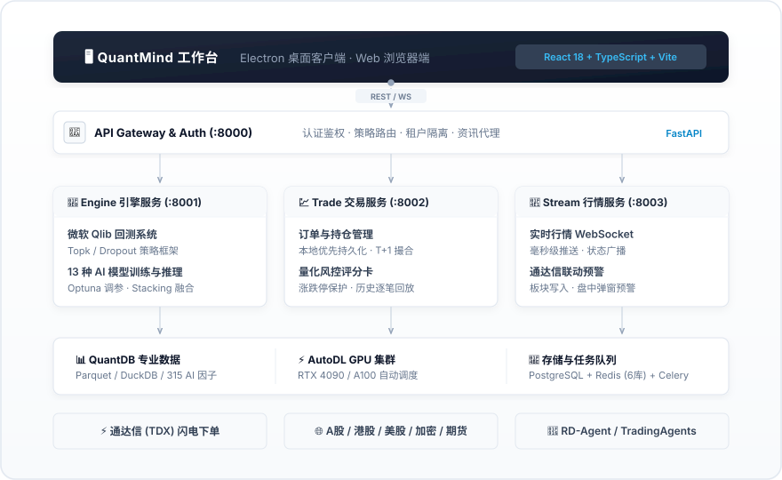
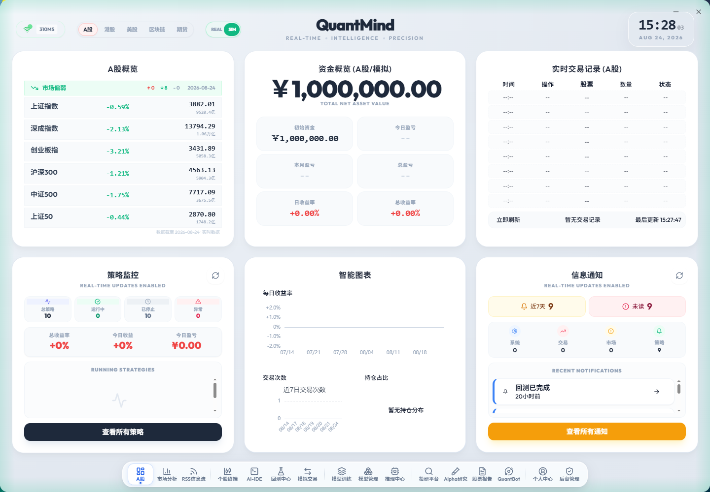
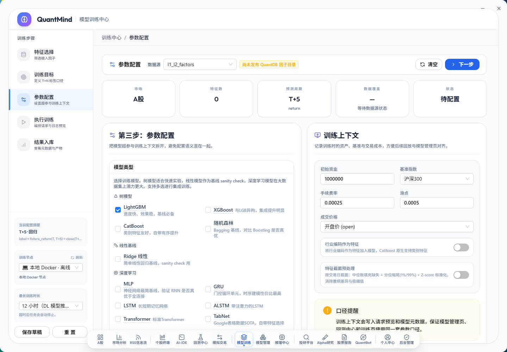
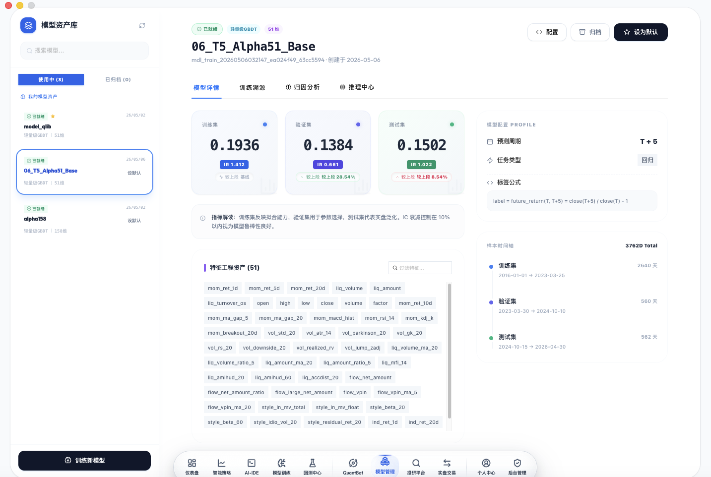
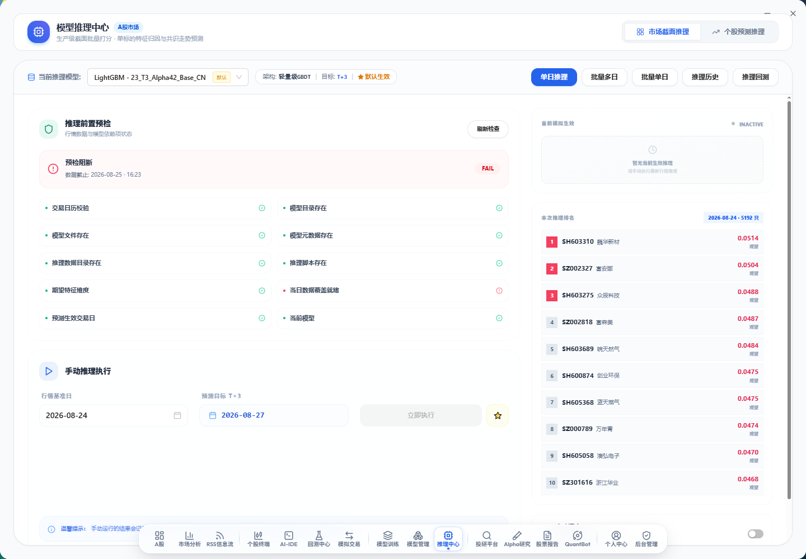
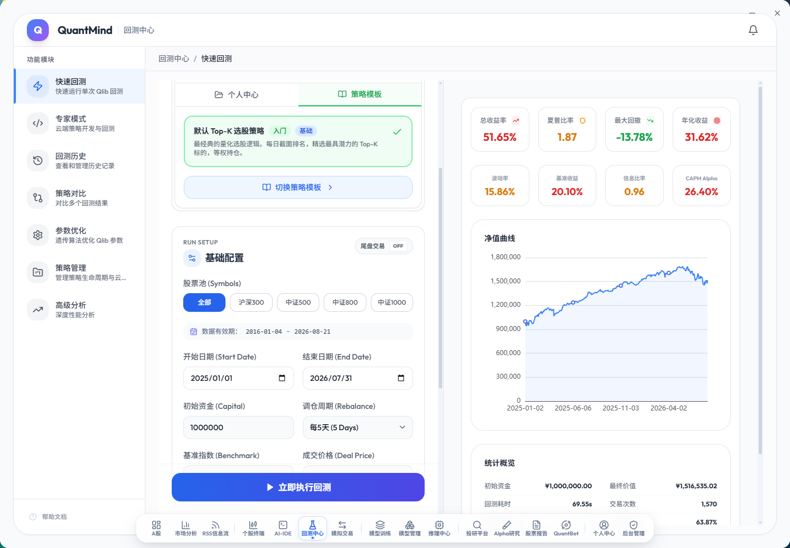
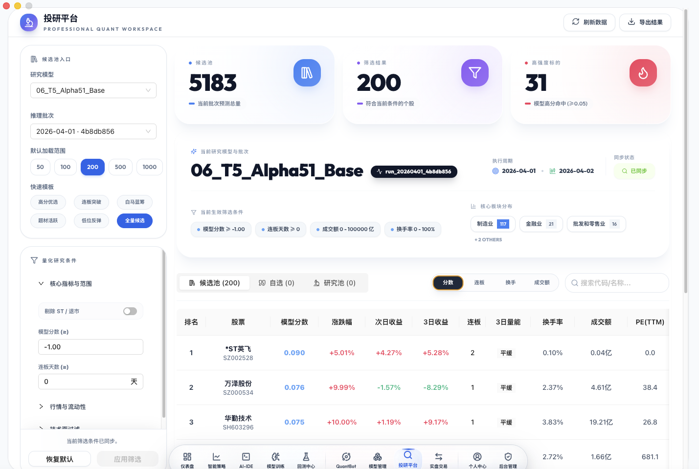
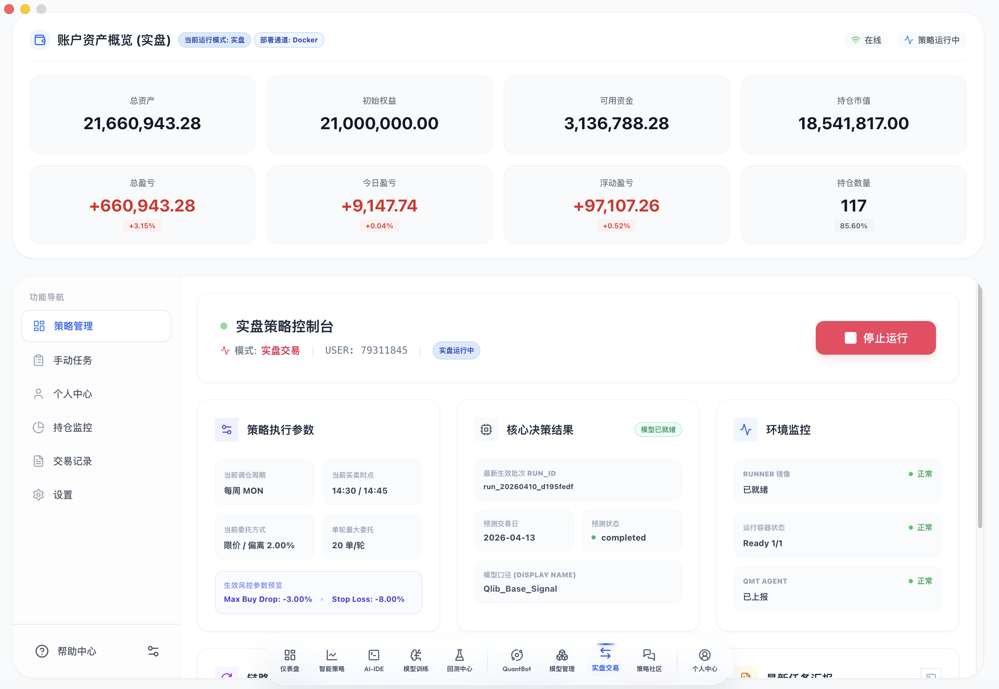

<h1 align="center">QuantMind</h1>

<p align="center">
  <strong>AI 驱动的多市场工业级量化交易平台</strong>
</p>

<p align="center">
  数据采集 · 因子挖掘 · 模型训练 · 策略回测 · 智能推理 · 通达信联动 · 实盘交易
</p>

<p align="center">
  <a href="#-快速开始">快速开始</a> •
  <a href="#-系统架构">系统架构</a> •
  <a href="#-核心功能">核心功能</a> •
  <a href="#-ai-能力">AI 能力</a> •
  <a href="#-回测引擎">回测引擎</a> •
  <a href="#-部署指南">部署指南</a> •
  <a href="#-致谢">致谢</a>
</p>

<p align="center">
  
  
  
  
  
  
</p>

---

## 📖 项目简介

QuantMind 是一个端到端的 AI 原生量化交易平台，深度集成微软 **Qlib** 量化框架、**RD-Agent** 研发智能体与 **TradingAgents** 多 Agent 投研，支持 **A 股、港股、美股、区块链、期货** 五大市场。

与传统手工调因子的量化模式不同，QuantMind 让机器学习和深度学习模型自动从 151+ 维特征中学习市场规律，实现从数据准备、因子挖掘、模型训练（支持本地/远程 GPU）、模型版本管理、批量推理、信号生成到通达信/实盘下单的全闭环。

**核心能力：**
- **多市场数据底座**：原生接入 QuantDB 专业数据中枢，5000+ 标的、300+ 预计算因子 L1+L2，Parquet/DuckDB 秒级存算。
- **13 种 ML/DL 模型工场**：内置 LightGBM、XGBoost、CatBoost、GRU、LSTM、ALSTM、Transformer、TabNet、TCN、NativeTFT 等，支持 Optuna 自动调参、多周期加权与 Stacking 集成。
- **AI 因子自动挖掘**：基于微软 RD-Agent 的自动化因子进化框架与 AlphaAgent 编码专家系统。
- **多 Agent 智能投研**：TradingAgents 7 位 AI 分析师角色协同、观点辩论博弈与自动化研报生成。
- **模型全生命周期与生产监控**：A/B 对比、每日真实 Rank IC 回填、特征漂移检测与软门禁。
- **通达信 (TDX) 深度联动**：模型选股结果一键写入通达信自定义板块、盘中实时预警雷达、双击闪电下单。
- **实盘/模拟交易与风控**：T+1 撮合、涨跌停保护、微结构风控及多维风险评分卡。

---

## 🚀 快速开始

### 环境要求

- Docker & Docker Compose
- 32GB+ 内存（推荐 64GB，用于千万级特征加载与深度学习训练）
- 50GB+ 磁盘空间（含历史数据）
- NVIDIA GPU（可选，用于深度学习加速与 AutoDL 远程训练）

### 一键部署

```bash
# 1. 克隆仓库
git clone https://github.com/qusong0627/QuantMind.git
cd QuantMind

# 2. 配置环境变量
cp .env.example .env
# 编辑 .env，设置 DB_PASSWORD、SECRET_KEY 等

# 3. 启动所有服务
docker compose up -d

# 4. 同步 QuantDB A股量化数据（可选）
docker exec quantmind python backend/scripts/quantdb_daily_sync.py
```

### 访问入口

服务启动后即可访问：
- **Web 控制台**: `http://localhost:3000`
- **API 接口网关**: `http://localhost:8000`
- **Swagger API 文档**: `http://localhost:8000/docs`
- **默认账号**: `admin` / `admin123`

---

## 🏗️ 系统架构

<p align="center">
  
</p>

### 服务职责

| 服务 | 端口 | 核心职责 |
|------|------|----------|
| **api** | 8000 | 用户认证、策略管理、数据平台、模型管理、新闻代理 |
| **engine** | 8001 | Qlib 回测、AI 策略生成、13 种模型训练/推理、Alpha 因子挖掘、投研编排 |
| **trade** | 8002 | 订单管理、持仓监控、模拟撮合、风控系统 |
| **stream** | 8003 | 实时行情接收、WebSocket 实时推送网关 |
| **celery** | - | 异步任务队列（数据同步、定时推理、质量回填） |

### 技术栈

| 领域 | 核心技术 |
|------|----------|
| **前端表现层** | Electron + React 18 + TypeScript + Vite + Ant Design + ECharts |
| **后端服务层** | Python 3.10 + FastAPI + SQLAlchemy + Celery + DuckDB |
| **AI 与量化** | Microsoft Qlib + PyTorch + LightGBM + XGBoost + CatBoost + Optuna |
| **数据与存储** | QuantDB + Parquet 列式存储 + PostgreSQL + Redis（6库隔离） |
| **基础设施** | Docker Compose + AutoDL GPU 训练桥梁 + Nginx |

---

## ✨ 核心功能

<!-- ========================================== -->
<!-- 模块 1: 仪表盘全景 -->
<!-- ========================================== -->
### 1. 市场看板与监控中心

提供全市场行情大屏、资金流向、大盘指数热度与自选股盯盘。

<p align="center">
  
</p>

---

<!-- ========================================== -->
<!-- 模块 2: AI 模型训练工场 -->
<!-- ========================================== -->
### 2. AI 模型训练工场 (Model Training)

可视化配置训练参数，支持 13 种机器学习与深度学习算法，内置 Optuna 自动调参、WFA 滚动切分与 Stacking 集成。

<p align="center">
  
</p>

- **支持模型库**：LightGBM, XGBoost, CatBoost, RandomForest, Ridge, GRU, LSTM, ALSTM, Transformer, TabNet, TCN, NativeTFT, MLP。
- **自动特征工程**：覆盖动量、波动率、流动性、风格暴露、资金流等 151+ 维特征。
- **算力弹性调度**：支持本地 CPU/GPU 与一键推送到 AutoDL 远程 GPU 集群。

---

<!-- ========================================== -->
<!-- 模块 3: 模型管理与生产监控 -->
<!-- ========================================== -->
### 3. 模型管理与生产监控 (Model Registry)

统一管理模型全生命周期，实现持续监控与版本对比。

<p align="center">
  
</p>

- **生产质量跟踪**：每日自动回填真实 Rank IC、ICIR 表现。
- **漂移预警与软门禁**：特征重要性 SHAP 分析，性能衰减自动告警。
- **多模型 A/B 对比**：多维度指标雷达对比，辅助生产模型切换。

---

<!-- ========================================== -->
<!-- 模块 4: 批量推理与信号中心 -->
<!-- ========================================== -->
### 4. 批量推理与选股信号 (Inference Hub)

支持全市场批量截面排序、Top N 标的推荐、信号动态融合与历史回溯。

<p align="center">
  
</p>

---

<!-- ========================================== -->
<!-- 模块 5: 微软 Qlib 回测中心 -->
<!-- ========================================== -->
### 5. 微软 Qlib 回测中心 (Backtest Center)

基于微软 Qlib 引擎的高性能事件驱动回测，全面评估策略收益与风险。

<p align="center">
  
</p>

---

<!-- ========================================== -->
<!-- 模块 6: Multi-Agent 智能投研平台 -->
<!-- ========================================== -->
### 6. Multi-Agent 智能投研平台 (TradingAgents)

7 位 AI 分析师角色协同（基本面、量价技术、资金流、宏观策略、估值、情绪、风控），多轮辩论博弈输出结构化研报。

<p align="center">
  
</p>

---

<!-- ========================================== -->
<!-- 模块 7: 实盘模拟交易与风控系统 -->
<!-- ========================================== -->
### 7. 实盘模拟交易与风控评分卡 (Live Trading)

全链路模拟交易撮合、持仓监控与多维风险评分卡。

<p align="center">
  
</p>

---

<!-- ========================================== -->
<!-- 模块 8: 通达信 (TDX) 深度联动 -->
<!-- ========================================== -->
### 8. 通达信 (TDX) 深度联动生态

模型选股结果自动推送通达信自定义板块、盘中预警雷达弹窗与**双击闪电下单**。

```
模型截面打分 ➔ Top-N 选股 ➔ 通达信板块写入 / 预警弹窗 ➔ 双击闪电下单 ⚡
```

---

## 🤖 AI 能力

### 1. RD-Agent 自动化因子挖掘
- 微软 RD-Agent 因子自动进化框架
- LLM 驱动假设生成 ➔ 公式合成 ➔ 历史回测 ➔ 优胜劣汰迭代
- AlphaAgent 因子编码系统，自动生成标准化计算逻辑

### 2. QuantBot 智能量化助手
- 自然语言交互驱动：查行情、看持仓、跑回测、训练模型
- 意图识别与任务自动调度

### 3. Claude Code Skills（20+ 技能包）
- 部署运维、模型训练、因子挖掘、投研分析全流程技能支持

---

## 📈 回测引擎

基于微软 Qlib 的高性能回测示例：

### 快速回测

```python
from qlib.contrib.strategy import TopkDropoutStrategy
from qlib.backtest import backtest

# 配置策略
strategy = TopkDropoutStrategy(
    signal=pred_signal,
    topk=30,
    n_drop=5,
)

# 执行回测
report, indicator = backtest(
    strategy=strategy,
    start_time="2024-01-01",
    end_time="2026-06-30",
    account=1000000,
    benchmark="SH000300",
)
```

### 回测参数说明

| 参数 | 说明 | 推荐值 |
|------|------|--------|
| `topk` | 组合持仓股票数量 | 30 ~ 50 |
| `n_drop` | 每次换仓卖出股票数 | 3 ~ 5 |
| `rebalance_period` | 调仓周期 | 1天 / 3天 / 5天 |
| `benchmark` | 比较基准指数 | SH000300 (沪深300) / SH000905 (中证500) |
| `commission` | 手续费率 | 0.00025 |

---

## 📚 项目结构

```
quantmind/
├── backend/
│   ├── main_oss.py                 # 统一服务入口（api/engine/trade/stream）
│   ├── shared/                     # 跨服务共享模块（DB/Redis/代码工具/日历）
│   ├── services/
│   │   ├── api/                    # API 服务 (:8000)
│   │   ├── engine/                 # 引擎服务 (:8001 Qlib/训练/推理/Agent)
│   │   │   ├── training/           # 13 种模型训练编排（本地/AutoDL）
│   │   │   ├── inference/          # 截面推理与信号生成
│   │   │   ├── qlib_app/           # Qlib 回测与策略
│   │   │   ├── rd_agent/           # RD-Agent 因子挖掘
│   │   │   └── trading_agents/     # 多 Agent 投研
│   │   ├── trade/                  # 交易服务 (:8002 订单/持仓/风控)
│   │   └── stream/                 # 行情服务 (:8003 WebSocket 推送)
│   ├── scripts/                    # QuantDB 同步与特征计算脚本
│   └── tests/                      # 测试用例套件
├── electron/                       # 前端工程
│   └── src/
│       ├── pages/                  # 核心页面（ModelTraining/Registry/Backtest等）
│       ├── features/               # 功能特性模块
│       ├── components/             # UI 组件
│       └── services/               # API 客户端与服务封装
├── TradingAgents-astock/           # 多 Agent 投研模块
├── docker/                         # Docker 镜像构建配置
├── db/                             # 本地数据目录与特征快照
└── docker-compose.yml              # 容器编排定义
```

---

## 🛠️ 部署指南

### 生产环境部署

```bash
# 1. 克隆代码
git clone https://github.com/qusong0627/QuantMind.git
cd QuantMind

# 2. 配置环境变量
cp .env.example .env
# 编辑 .env 配置 DB_PASSWORD、SECRET_KEY 等

# 3. 启动所有服务容器
docker compose up -d

# 4. 同步 QuantDB 数据
docker exec quantmind python backend/scripts/quantdb_daily_sync.py
```

### 前端开发

```bash
cd electron
npm install
npm run dev          # Electron 桌面端
npm run dev:web      # Web 浏览器端
npm run typecheck    # 类型检查
```

### 后端开发

```bash
# 单服务启动调试
SERVICE_MODE=api python backend/main_oss.py
SERVICE_MODE=engine python backend/main_oss.py

# 运行测试
python backend/run_tests.py unit
python backend/run_tests.py integration
```

---

## ⏰ 定时任务

| 任务 | 时间 | 说明 |
|------|------|------|
| `quantdb_daily_sync` | 22:30 工作日 | QuantDB 全量与增量数据同步 |
| `rebuild_qlib_cache` | 22:40 工作日 | 重建 Qlib 二进制缓存 |
| `feature_snapshots`  | 22:50 工作日 | 生成特征快照 Parquet |
| `auto_inference`     | 00:00 工作日 | 活跃模型自动推理 |
| `ic_backfill`        | 02:30 工作日 | 生产 Rank IC 真实回填与漂移监控 |

---

## ⚙️ 环境变量

| 变量 | 说明 | 默认值 |
|------|------|--------|
| `DB_HOST` | PostgreSQL 主机 | `db` |
| `DB_PORT` | PostgreSQL 端口 | `5432` |
| `DB_NAME` | 数据库名 | `quantmind` |
| `DB_USER` | 数据库用户 | `quantmind` |
| `DB_PASSWORD` | 数据库密码 | - |
| `REDIS_HOST` | Redis 主机 | `redis` |
| `REDIS_PORT` | Redis 端口 | `6379` |
| `SECRET_KEY` | 应用密钥 | - |
| `JWT_SECRET_KEY` | JWT 密钥 | - |
| `QUANTDB_API_KEY` | QuantDB 数据源 Key | - |

---

## 🤝 贡献指南

欢迎提交 Issue 和 Pull Request！

```bash
# 1. Fork 仓库
# 2. 创建特性分支
git checkout -b feature/your-feature

# 3. 提交更改
git commit -m "feat: add your feature"

# 4. 推送并创建 PR
git push origin feature/your-feature
```

---

## 📄 License

[GNU Affero General Public License v3.0](LICENSE)

---

## ⚠️ 免责声明

> **本项目仅供学习研究与技术演示，不构成任何投资建议。**
>
> - 本系统产出的所有分析报告和交易信号均由 AI 算法自动生成，可能存在误差或失效风险
> - 实际投资决策请结合自身风险承受能力或咨询合规专业机构
> - 作者与贡献者不对使用本开源软件产生的任何投资损失承担责任
> - **股市有风险，入市需谨慎**

---

## 🙏 致谢

### 核心框架与算法
- [Qlib](https://github.com/microsoft/qlib) — 微软开源 AI 量化投资平台
- [RD-Agent](https://github.com/microsoft/RD-Agent) — 微软研发智能体框架
- [AlphaAgent](https://github.com/ModelTC/AlphaAgent) — 因子进化框架
- [TradingAgents-Astock](https://github.com/simonlin1212/TradingAgents-astock) — 多 Agent A 股投研框架
- [LightGBM](https://github.com/microsoft/LightGBM) / [XGBoost](https://github.com/dmlc/xgboost) / [CatBoost](https://github.com/catboost/catboost) — 经典梯度提升树算法
- [PyTorch](https://pytorch.org/) — 深度学习研究框架
- [FastAPI](https://fastapi.tiangolo.com/) — 现代高性能 Web 接口框架

### 数据源与工具
- [QuantDB](https://quantdb.quantmind.cloud/) — 专业量化数据中枢
- [DuckDB](https://duckdb.org/) / [PyArrow](https://arrow.apache.org/) — 高性能列式存算引擎
- [exchange_calendars](https://github.com/gerrymanoim/exchange_calendars) — 全球交易所交易日历

---

## 💬 交流社区

<p align="center">
  
  <br/>
  <b>QQ 交流群号：1097406397</b>
</p>

---

<p align="center">
  <strong>QuantMind</strong> — 让量化交易更简单
  <br/>
  <i>Data-Driven · AI-Powered · Multi-Market Quantitative Trading Platform</i>
</p>
