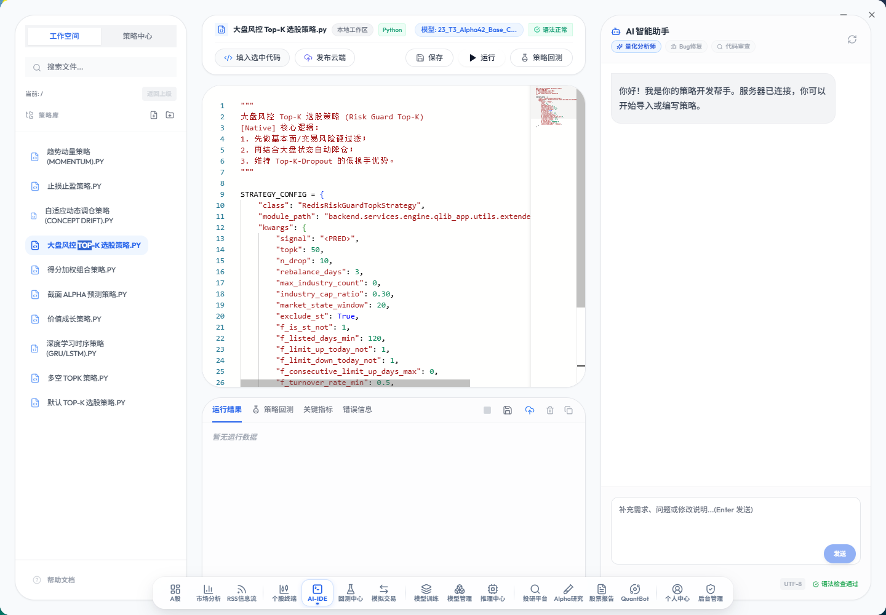
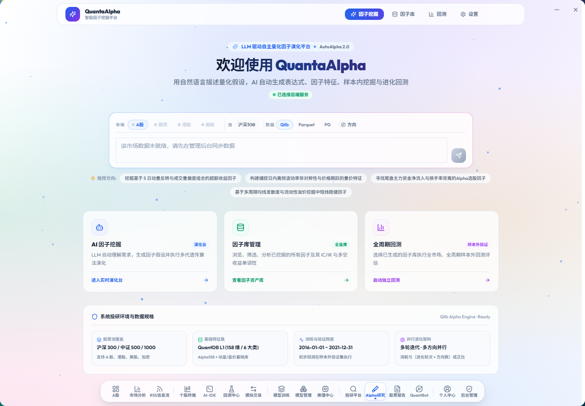
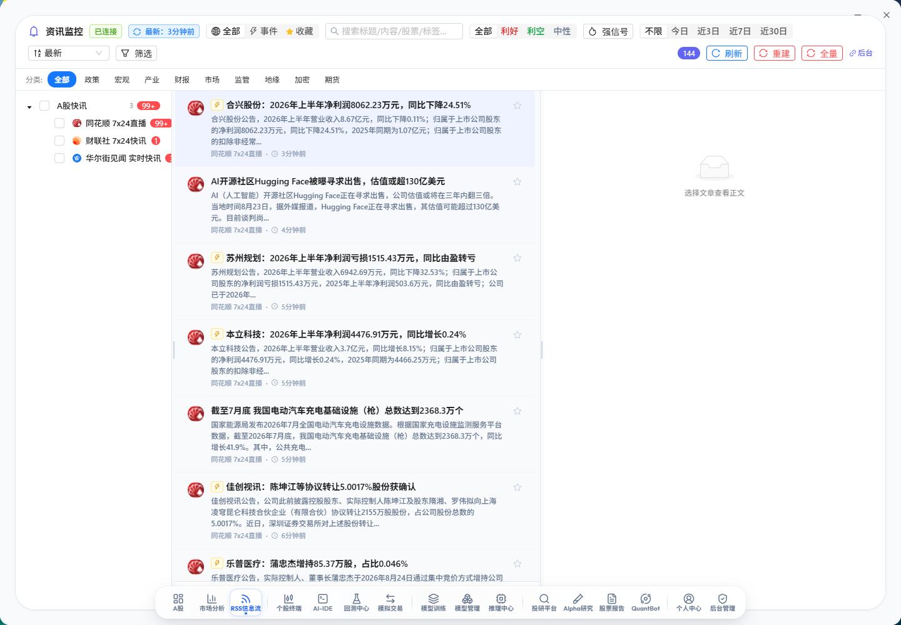

<h1 align="center">QuantMind (量化大脑) OSS</h1>

<p align="center">
  <strong>AI 原生 · 13 种模型工场 · 因子自主进化 · 通达信联动 · 工业级量化投研与交易平台</strong>
</p>

<p align="center">
  
  
  
  
  
  
  
</p>

---

## 📖 项目简介

**QuantMind（量化大脑）** 是面向个人量化研究者、投研团队与专业机构的一体化 AI 原生量化交易平台。深度集成微软 **Qlib** 量化框架、**RD-Agent** 研发智能体与 **TradingAgents** 多 Agent 投研体系，全面打通：

$$\text{数据底座} \longrightarrow \text{因子挖掘} \longrightarrow \text{模型训练} \longrightarrow \text{批量推理} \longrightarrow \text{组合回测} \longrightarrow \text{通达信联动/实盘} \longrightarrow \text{生产监控}$$

支持 **A 股、港股、美股、期货与区块链** 五大市场，帮助研究者摆脱繁琐的数据清洗与拼装，让模型自动从 300+ 维特征中挖掘 Alpha 规律。

### 🌟 核心模块

| 模块 | 能力与技术亮点 |
| --- | --- |
| **📊 市场与数据** | 接入 QuantDB 数据中枢，300+ 维预计算因子（L1+L2 微观结构/资金流），Parquet + DuckDB 秒级存算，7x24 RSS 舆情快讯与情绪量化 |
| **🔬 因子自主进化** | 基于微软 **RD-Agent** 的 AutoAlpha 2.0 因子挖掘框架，LLM 自主生成量化假设 ➔ 公式合成 ➔ 遗传演化回测 ➔ 优选入库 |
| **🧠 13 种模型工场** | 内置 LightGBM、XGBoost、CatBoost、GRU、LSTM、ALSTM、Transformer、TabNet、TCN、NativeTFT 等，支持 **Optuna 自动调参** 与 **Stacking 集成** |
| **⚡ 批量推理与选股** | 全市场每日截面批量打分、Top-N 标的推荐、信号动态融合与生产 Rank IC 真实回填监控 |
| **📈 微软 Qlib 回测** | 高性能事件驱动回测引擎，支持 TopkDropout 策略、交易费率与滑点模拟、风险收益多维归因 |
| **🚀 通达信深度联动** | 模型选股信号**一键推入通达信自定义板块**、盘中实时预警雷达弹窗、**双击闪电下单** ⚡ |
| **🛡️ 模拟实盘与风控** | 本地 T+1 撮合、持仓与订单全生命周期管理、涨跌停保护、订单微结构风控评分卡 |

---

## 🚀 快速部署

系统基于 Docker 容器化编排，推荐使用 Ubuntu 22.04 / 24.04 运行环境。

### 完整离线部署（推荐 · 生产就绪）

离线包内含完整预构建镜像、业务数据、预训练模型、Qlib 数据与 PostgreSQL 初始化备份：

```bash
curl -fsSL https://gitee.com/qusong0627/QuantMind/raw/master/deploy/offline-deploy.sh | sudo bash
```

部署完成后即可访问：
- **Web 控制台**: `http://<服务器 IP>:3000`
- **API 接口网关**: `http://<服务器 IP>:8000`
- **Swagger API 文档**: `http://<服务器 IP>:8000/docs`
- **默认管理员账号**: `admin` / `admin123`

```bash
# 可选：指定离线包镜像源或代码分支
sudo QUANTMIND_OFFLINE_BASE_URL='https://example.com/quantmind-offline' \
  QUANTMIND_REF='master' \
  bash deploy/offline-deploy.sh
```

### 在线部署与一键更新

```bash
# 在线部署
curl -fsSL https://gitee.com/qusong0627/QuantMind/raw/master/deploy/deploy.sh | sudo bash

# 已部署服务器的一键平滑更新（不清除数据库与模型资产）
sudo bash deploy/update.sh
```

> 详细部署配置与环境变量说明请参阅 [deploy/README.md](deploy/README.md)。

---

## 🖥️ 产品预览

QuantMind 将日常量化研究工作流整合在同一套高颜值、现代化的交互界面中：

### 1. 市场监控与资产看板
提供全市场行情大屏、资金流向、大盘指数热度与自选股盯盘。


### 2. AI-IDE 策略开发工作区
内置代码编辑器与量化 AI Copilot 助手，支持策略编写、语法检查、一键回测与云端发布。


### 3. QuantaAlpha 智能因子挖掘平台
基于 LLM 驱动自主量化因子演化平台（AutoAlpha 2.0），用自然语言描述量化假设，AI 自动生成表达式与进化回测。


### 4. AI 模型训练工场 (Model Training)
可视化配置训练参数，支持 13 种 ML/DL 算法，内置 Optuna 自动调参、WFA 滚动切分与本地/AutoDL 算力调度。


### 5. 批量推理与选股信号中心 (Inference Hub)
支持全市场批量截面排序、Top N 标的推荐、信号动态融合与历史回溯。


### 6. 微软 Qlib 回测中心 (Backtest Center)
基于微软 Qlib 引擎的高性能事件驱动回测，全面评估策略收益与最大回撤风险。


### 7. 实时舆情与 RSS 资讯监控 (News & RSS Stream)
汇聚主流财经媒体 7x24 实时快讯、事件标签识别、利好/利空情绪分类与正文实体关联分析。


<details>
  <summary><b>📐 点击展开查看系统架构图</b></summary>
  <br>
  <p align="center">
    
  </p>
</details>

---

## 💻 本地开发

```bash
# 1. 后端单元测试
python backend/run_tests.py unit

# 2. 前端开发环境
cd electron
npm install
npm run dev          # 桌面端 (Electron)
npm run dev:web      # Web 模式
npm run typecheck    # TypeScript 类型检查
```

后端服务统一由 `backend/main_oss.py` 单入口编排启动：
- **API 服务** (`:8000`)：用户认证、策略管理、数据平台、模型管理、新闻代理
- **Engine 服务** (`:8001`)：Qlib 回测、AI 训练/推理、Alpha 因子挖掘、投研编排
- **Trade 服务** (`:8002`)：订单管理、持仓监控、模拟撮合、风控系统
- **Stream 服务** (`:8003`)：实时行情接收、WebSocket 推送网关

---

## 📁 项目结构

```text
quantmind/
├── backend/                  # FastAPI 后端微服务与 Qlib 引擎
│   ├── main_oss.py           # 统一服务入口
│   ├── services/             # api / engine / trade / stream 四大服务
│   ├── shared/               # 跨服务共享模块 (DB/Redis/代码规范/日历)
│   └── scripts/              # 数据同步与特征计算脚本
├── electron/                 # Electron + React + TypeScript 桌面/Web 前端
├── deploy/                   # 在线/离线部署与一键更新脚本
├── docs/                     # 部署、架构与外部集成说明
├── scripts/                  # 按用途归档的开发、校验、数据与历史脚本
├── db/qlib_data/             # 本地 Qlib 格式二进制与 Parquet 数据
├── docker/                   # Dockerfile 镜像构建配置
└── docker-compose.yml        # 容器服务编排定义
```

架构说明见 [docs/development/architecture.md](docs/development/architecture.md)，源码包部署见 [docs/deployment/source-bundle.md](docs/deployment/source-bundle.md)，通达信桥接见 [docs/integrations/tdx-bridge.md](docs/integrations/tdx-bridge.md)。

---

## 🤝 规范与贡献

- **代码规范**：Python 遵循 PEP8（使用 ruff 检查与格式化）；前端提交前请执行 `npm run typecheck`。
- **股票代码标准化**：所有内部 Redis 键、数据库字段及 API 参数**强制采用前缀格式**（如 `SH600036`、`SZ000001`、`BJ832000`）。

欢迎提交 Issue 与 Pull Request！

---

## ⚠️ 免责声明

> **本项目仅供学习研究与技术演示，不构成任何投资建议。**
>
> - 本系统产出的所有分析报告和交易信号均由 AI 算法自动生成，可能存在误差或失效风险；
> - 实际投资决策请结合自身风险承受能力或咨询合规专业机构；
> - 作者与贡献者不对使用本开源软件产生的任何投资损失承担责任；
> - **股市有风险，入市需谨慎。**

---

## 🙏 致谢

- [Microsoft Qlib](https://github.com/microsoft/qlib) — 微软开源 AI 量化投资平台
- [Microsoft RD-Agent](https://github.com/microsoft/RD-Agent) — 微软研发智能体框架
- [TradingAgents-Astock](https://github.com/simonlin1212/TradingAgents-astock) — 多 Agent A 股投研框架
- [LightGBM](https://github.com/microsoft/LightGBM) / [CatBoost](https://github.com/catboost/catboost) / [XGBoost](https://github.com/dmlc/xgboost) — 经典梯度提升树算法
- [FastAPI](https://fastapi.tiangolo.com/) & [PyTorch](https://pytorch.org/) — 现代高性能后端与深度学习底座

---

## 💬 交流社区

<p align="center">
  
  <br/>
  <b>QQ 交流群号：1097406397</b>
  <br/>
  <i>欢迎加入社群交流量化算法、模型调优与部署心得！</i>
</p>
